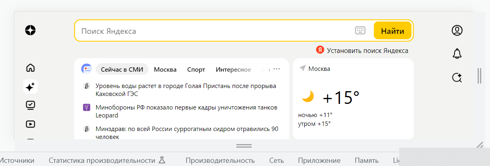
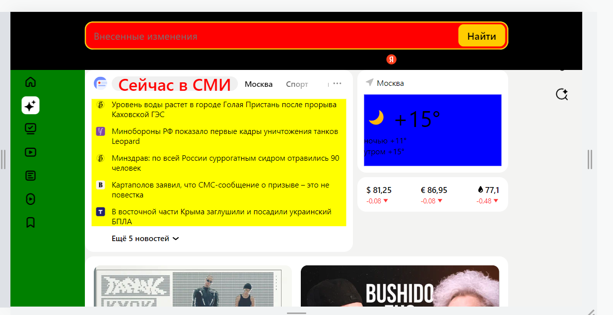
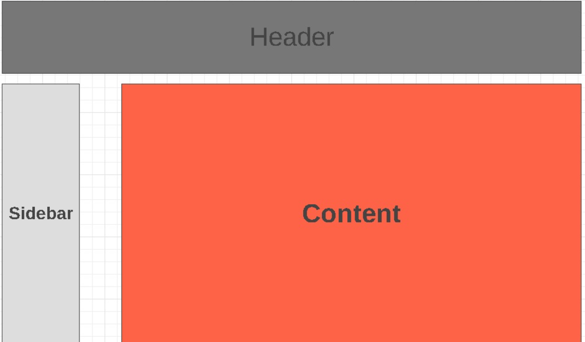

# Задача: на основе сайта yandex.ru:
- Определите, на каком протоколе работает сайт.
- Проанализируйте структуру страницы сайта.
- Внесите не менее 10 изменений на страницу с помощью инструмента разработчика и представьте скриншоты было/стало.
- Задание по желанию необязательное - Создайте прототип низкой детализации (дополнительное задание, если на семинаре дошли до задания №8).

## 1- сат yandex.ru работает на защищенном протоколе https
## 2- Сайт yandex.ru имеет стандартную структуру
основной тег html с вложенными head & body
В теге body имеются основные разделы-блоки:
    - скрытый блок
    - блок с классом content
    - скрытый блок
Так же в блоке body подключены стили и скрипты  

## 3- 
* Текст в input
1. удаленная иконка в input
2. удалена иконка левее инпут
3. Изменен background  у body
4. Именен цвет текста "Сейчас в СМИ"
5. Именен font-size "Сейчас в СМИ"
6. изменен цвет фона input
7. изменен цвет фона левой секции
8. изменен цвет фона правой секции
9. изменен цвет фона средней секции

## 4 -

